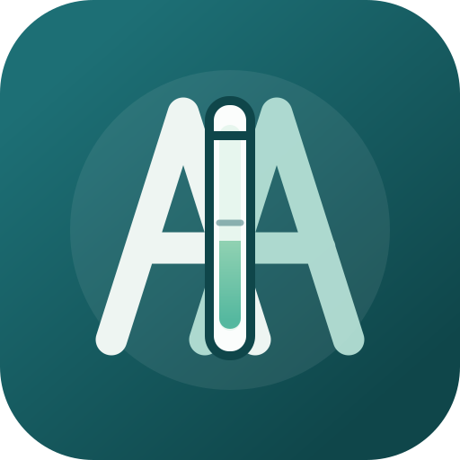

# Absorbance Adjuster



Absorbance Adjuster is a small offline app for adjusting sample absorbance during spectroscopy experiments. It is available as both a direct-open PC browser version and an Android WebView app. It helps calculate whether to add solvent or raw suspension, records adjustment operations by sample number, and generates copy-ready experiment-note descriptions.

The app is designed for lab use cases where the calculated volume may not be the exact volume actually pipetted. Manual volume edits are treated as the real sample state when a step is logged.

## Features

- Calculate solvent addition when absorbance is too high.
- Calculate raw suspension addition when absorbance is too low.
- Track multiple samples at the same time using `Sample No.`.
- Log operation records separately for each sample.
- Generate final conduction descriptions for all logged samples.
- Copy final descriptions directly into experiment notes.
- Support `uL` and `mL` volume units.
- PC browser version that opens directly from `pc-version/index.html`.
- Android APK wrapper around the same offline HTML/CSS/JavaScript app.

## App Workflow

1. Enter sample setup information:
   - Sample No.
   - Sample volume
   - Solvent already present
   - Solvent name
   - Excitation wavelength
2. Enter current absorbance and target absorbance.
3. Press `Calculate`.
4. If you actually add the calculated volume, press `Add into sample`.
5. If you manually add a rounded volume instead, type the real new volume into the volume fields.
6. Press `Log step`.
7. Press `Generate` to create final descriptions for all logged samples.
8. Press `Copy description` to copy the text into your lab notes.

See [docs/USER_MANUAL.md](docs/USER_MANUAL.md) for a more detailed guide.

## Use On PC

Open this file directly in a browser:

```text
pc-version/index.html
```

No server is required. This version is useful for checking the app on a computer before building or installing the Android APK.

## Project Structure

```text
pc-version/
  index.html              Direct-open PC browser app
  app.js                  Calculation, logging, and description logic
  styles.css              App styling
  icon.svg                Web/PWA icon

app/src/main/assets/
  index.html              Android WebView copy of the web app UI
  app.js                  Android WebView copy of the app logic
  styles.css              Android WebView copy of the app styling
  icon.svg                Android WebView copy of the web/PWA icon

app/src/main/java/
  MainActivity.java       Android WebView wrapper

app/src/main/res/
  drawable/               Android launcher icon foreground
  values/                 App name, colors, and theme
```

## Build APK

Open this folder in Android Studio and build:

```text
Build > Build Bundle(s) / APK(s) > Build APK(s)
```

Or use the Gradle wrapper from this folder:

```powershell
.\gradlew.bat assembleDebug
```

The debug APK will be created at:

```text
app/build/outputs/apk/debug/app-debug.apk
```

## Install On Android

Copy the APK to your phone, open it, and allow installation from unknown apps if Android asks. This is expected for a locally built debug APK.

## Notes

- The app runs offline after installation.
- It uses a local Android WebView and does not require a server.
- Calculations assume absorbance is linear with concentration.
